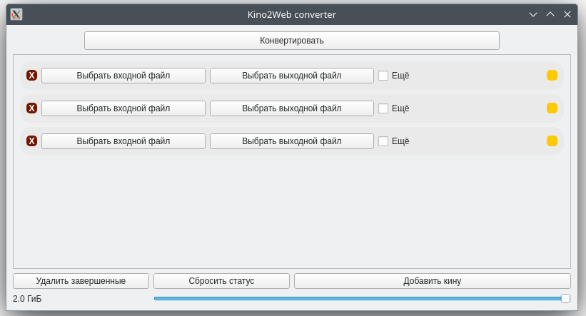

# Kino2Web
## Description
Program helps to convert films and other videos to format and size that could be loaded to web sites and messangers.



## Base functions
* GUI interface
* Convert to mp4
* Change the size of video
* Automaticaly calculate paramenetrs to get video of goal size

## Requirements
All requirements are in `requirements.txt`

Program is written in Python, with PyQt6 and ffmpeg.

## Instalation
You can download binary version of program from `here`.

Also you can use source code. To do this, use:

```bash

git clone https://github.com/dovydenkovas/Kino2Web
cd Kino2Web
python -m venv env
. env/bin/activate
pip install -r requirements.txt
python Kino2Web

```
